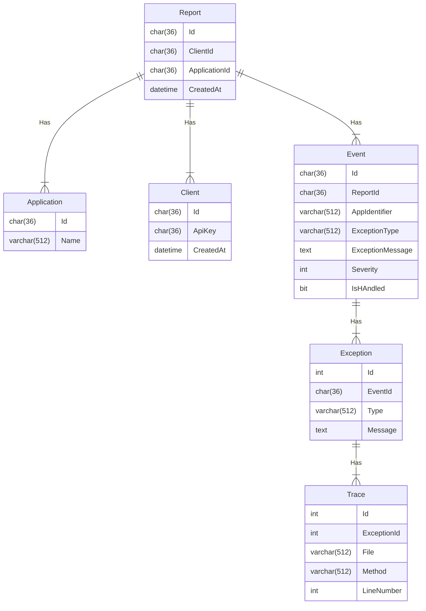

# [WIP] Error monitoring

A web API for collecting app errors (BugSnag lite). 

The API will support registering and retrieving app error reports as well as setting up webhooks to facilitate report notification to other apps. 

The purpose of the API is not to be used as a log but rather just a notification system so some sort of report cleanup functionality will also be added at some point.

Dotnet client implementation [Kwtc.ErrorMonitoring.Client](https://github.com/kwtc/error-monitoring-client-dotnet)

## Features
- [X] [Containerization](#containerization)
- [X] [API key authorization](#api-authorization) (simple)
- [X] Post error reports
    - [X] Post single error report
- [ ] Request error events
    - [ ] Get single event by identifier
    - [X] Get all events by client and app identifier
- [ ] Update error events
    - [ ] Update status for error event
- [X] [API versioning](#api-versioning)
- [ ] Support webhooks
- [ ] Report cleanup system

## Implementation details
This section will contain info related the implementation and configuration of the API.

### Data modelling



### Persistence
A docker compose file is provided that spins up a MySQL 8 environment, creates a database with a root user and password and executes an sql initialization file which is also provided, that creates tables matching the domain models.

Simply install Docker and run the following terminal command in the /database folder:

```console
docker compose up
```

A MySQL connection factory is registered by default and requires a connection string to be defined in appsettings.

```c#
var connection = new MySqlConnection(this.configuration.GetConnectionString("DefaultConnection"));
```

See example in `appsettings.Development.json` it is configured to work with the development database defined in the docker configuration.

### Nuget packages
The project is configured to use central package management so Nuget package versions are defined in the `Directory.Packages.props` file in the root of the project.

## <a name="containerization"></a>Containerization
Containerization is supported through [Microsoft.NET.Build.Containers](https://www.nuget.org/packages/Microsoft.NET.Build.Containers) so to build an image and subsequently run the image in Docker simply execute the following commands:

```console
dotnet publish --os linux --arch x64 -p:PublishProfile=DefaultContainer
```
If you are developing in a Linux environment you may need to throw in a sudo depending on your configuration.

```console
docker run -p 5000:80 kwtc-errormonitoring-api:1.0.0
```
This will only containerize and run the API so you will need to manually configure how to access the database depending on your setup.

## <a name="api-authorization"></a>API key authorization
Very basic API key authorization without roles is supported through the custom `[Authorization]` attribute. Requests to a decorated endpoint are required to contain a `x-api-key` header with a guid that is then used to lookup a client in the DB, if a client is found then you are authorized (which basically just makes it authentication I guess). 

## <a name="api-versioning"></a>API versioning
Although not super important for the project API versioning is supported using [Microsoft.AspNetCore.Mvc.Versioning](https://www.nuget.org/packages/Microsoft.AspNetCore.Mvc.Versioning/) and [Microsoft.AspNetCore.Mvc.Versioning.ApiExplorer](https://www.nuget.org/packages/Microsoft.AspNetCore.Mvc.Versioning.ApiExplorer) (because I wanted to play around with it). The `ApiControllerBase` class defines a base route with versioning which applies the version from the required `[ApiVersion]` class attribute. This does however pose the limitation that derived controllers can't define a route prefix on a class level, because it would override the versioning.

Swagger documentation of versions is automatically generated.